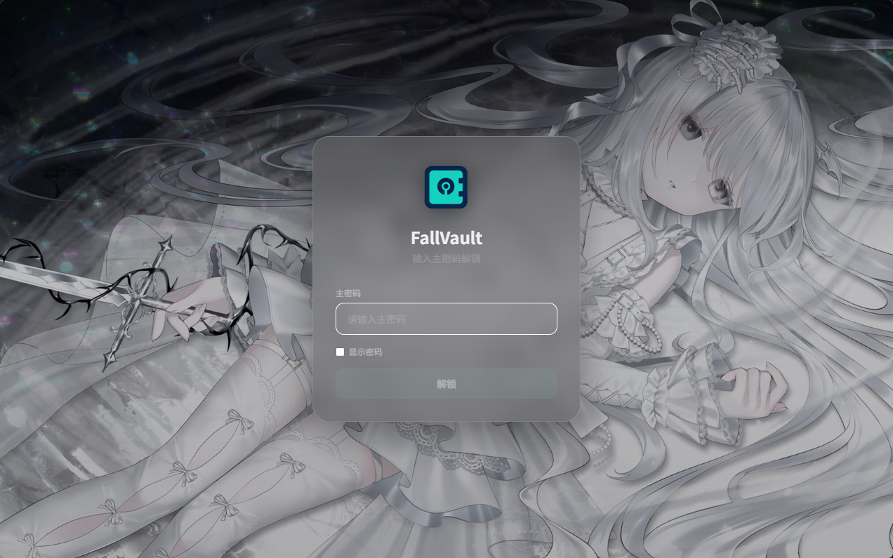
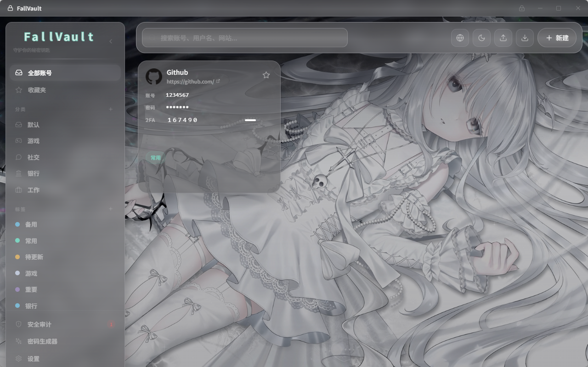
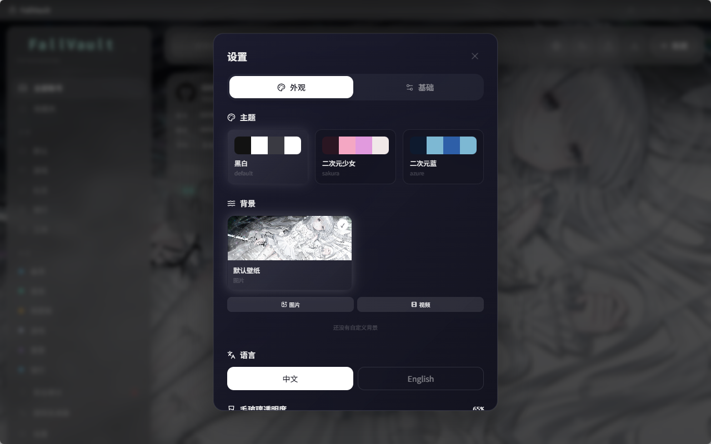
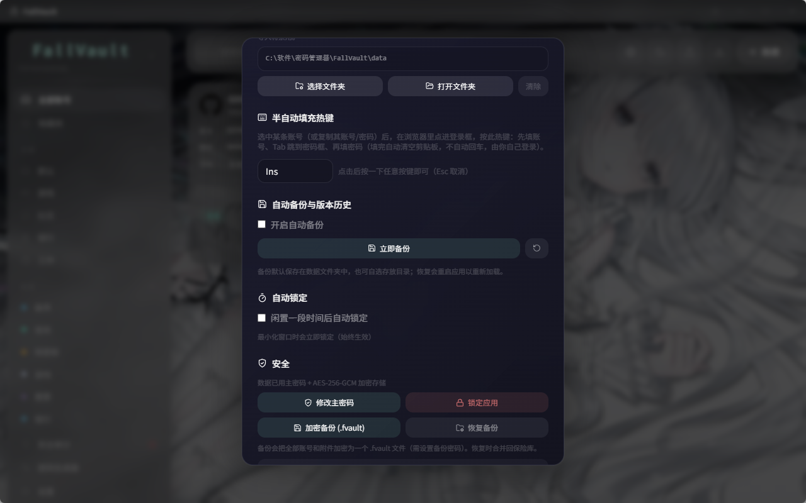
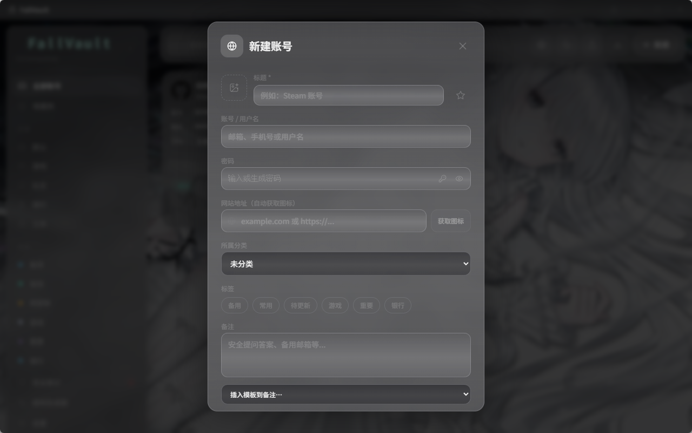

# FallVault 🍂🔐

> 一款现代化的**本地密码管理器**，守护你的每一把秘密钥匙。二次元毛玻璃风格，零服务器依赖，数据只属于你。


---

## 📖 项目简介

**FallVault** 是一款运行在 Windows 桌面的单机密码管理器，采用 [Tauri 2](https://tauri.app/) + React + TypeScript + Tailwind CSS 构建。它的设计目标是：**把密码安全地留在本机，同时拥有一套好看、好用的二次元毛玻璃界面**。

- 🔐 **端到端本地加密**：主密码 + AES-256-GCM，敏感字段加密存储，密钥由 PBKDF2（15 万次迭代）派生，仅在内存中短暂持有。
- 🏠 **零云依赖**：不连接任何服务器，所有数据（数据库、备份、图标、壁纸、附件）都存放在你指定的**本地数据文件夹**里。
- 🎨 **二次元美学**：三套主题（黑白 / 二次元少女粉紫 / 二次元蓝）+ 毛玻璃透明度自由调节，内置图片壁纸（随安装包打包，换机器不丢失）。
- 🧰 **全功能**：分类标签、全局搜索、密码强度、密码生成器、密码历史、TOTP 动态验证码、自动备份、自动锁定等一应俱全。

> ⚠️ 主密码无法找回：忘记主密码 = 数据永久丢失，请务必妥善保管。

---

## ✨ 功能特性

### 核心密码管理
- 📁 **文件夹分类** - 游戏、银行、社交等分类管理，支持增删改
- 🏷️ **标签系统** - 多维度打标签，快速筛选
- ⭐ **收藏置顶** - 常用账号一键置顶
- 🔍 **全局搜索** - 实时搜索标题、账号、网站
- 🔒 **密码强度检测** - 集成 zxcvbn，预估破解时间
- ⚡ **密码生成器** - 自定义规则生成强密码
- 📜 **密码历史** - 自动保存旧密码，支持回溯
- 🖼️ **网站图标自动获取** - 输入网址自动识别 logo，或上传自定义图标
- 📎 **附件加密存储** - 账号相关文件随条目加密保存
- 🧩 **自定义字段** - 任意扩展字段

### 动态验证码（TOTP / OTP）
- ⏱️ **TOTP 动态码** - 自动生成 6 位验证码，30 秒倒计时 + 进度条，一键复制
- 🔗 **密钥导入** - 直接粘贴 `otpauth://` URI、原始 Base32 密钥，或**谷歌验证器批量迁移链接**（`otpauth-migration://`，新建账号自动提取第一条，设置里可批量导入多条）
- 📲 **Google 验证器批量迁移** - 支持解析 `otpauth-migration://` 批量导入
- 🔄 **导出迁移** - 可反向生成 `otpauth://` URI 迁移到其他验证器

### 安全与备份
- 💾 **SQLite 本地存储** - 单文件数据库，零服务器依赖
- 🗄️ **加密自动备份（.fvault）** - 定时把整个保险库加密备份，与主密码同源加密，恢复时输入主密码即可
- 📦 **版本历史** - 自动保留多份历史备份，可回退
- 🔁 **恢复备份** - 导入旧的 `.fvault`，自动去重不重复添加
- 🌐 **浏览器密码导入** - 从 Chrome / Edge 导出的密码 CSV 一键导入（自动识别账号 / 密码 / 网址，跳过无密码行）
- 🔍 **安全审计** - 弱密码 / 重复密码 / 已泄露密码检测（离线）
- ☁️ **GitHub 私有仓库备份** - 设置页「GitHub 备份」标签：保存 PAT（存于 Windows 凭据管理器）→ 选私有仓库 → 一键把加密的 `.fvault` 备份（带时间文件名）推到仓库，或批量下载全部备份。支持**自动备份**（按 12/24/48/96 小时或测试用 1 分钟间隔）。**仅同步已加密文件，主密码绝不上传**（详见下方「GitHub 备份说明」）

### 界面与体验
- 🎨 **毛玻璃 UI** - 三套主题（黑白 / 二次元少女 / 二次元蓝）+ 毛玻璃透明度调节
- 🌊 **动态背景** - 内置图片壁纸（随安装包分发）、自定义图片 / 视频壁纸，可滚动缩略图墙选择与管理
- 🌐 **多语言** - 中文 / English 实时切换
- 🔒 **自动锁定 & 剪贴板清理** - 闲置自动锁屏、复制后定时清空剪贴板
- 🖥️ **启动即锁定 + 系统托盘** - 关闭窗口最小化到托盘并自动锁定，从托盘重新打开需再次输入主密码解锁
- 🔒 **单实例运行** - 多次双击 exe 只打开一个应用，重复启动会聚焦已存在的窗口
- 📤 **多格式导出** - 账号导出为 Excel (.xlsx) / 文本 (.txt)，格式整洁规范
- 📂 **数据文件夹自定义** - 所有文件（备份 / 壁纸 / 图标 / 附件）统一存放在你指定的本地文件夹
- 📋 **账号详情页** - 点击卡片打开大号详情面板，完整展示账号 / 密码（可显隐复制）/ TOTP / 自定义字段 / 备注 / 标签 / 附件，无需进入编辑
- ⌨️ **半自动浏览器填充** - 选中账号后按自定义热键（默认 `Ins`），自动填入账号 → `Tab` 跳到密码框 → 填入密码（填完清空剪贴板，不自动提交登录）。设置中按一下按键即可重新绑定热键

---

## 📸 界面预览

| 主密码 | 主页面 |
|--------|--------|
|  |  |

| 设置 | 基础设置 | 新建账号 |
|------|----------|----------|
|  |  |  |

---

## 🚀 快速开始

### 环境要求
- Node.js 18+
- Rust 1.70+
- Windows 10/11

### 开发运行
```bash
# 1. 克隆仓库
git clone https://github.com/b3050605492-bot/FallVault.git
cd FallVault

# 2. 安装前端依赖
npm install

# 3. 启动开发服务器
npm run tauri dev
```

### 构建安装包
```bash
npm run tauri build
```
构建完成后，安装包位于 `src-tauri/target/release/bundle/`（` .msi` 与 `.exe` 安装程序）。

---

## 🛠️ 技术栈

| 层级 | 技术 |
|------|------|
| 桌面框架 | [Tauri 2.0](https://tauri.app/) |
| 前端 | React 18 + TypeScript + Tailwind CSS |
| 状态管理 | Zustand |
| 数据库 | SQLite (tauri-plugin-sql) |
| 密码强度 | zxcvbn |
| 表格导出 | ExcelJS |
| 图标 | Lucide React |
| 加密 | Web Crypto（AES-256-GCM / PBKDF2）|
| 文件 IO | Rust std::fs 命令（绕过作用域限制，写入用户数据文件夹）|

---

## 📂 数据存储

所有数据**只存本地**，不上传任何服务器：

- **数据库**：`fallvault.db`（由 Tauri SQL 插件管理）
- **数据文件夹（用户自选）**：在 **设置 → 基础 → 数据文件夹** 中指定，所有文件统一存放：
  - `backups/` - 自动备份（`.fvault` 加密文件）
  - `media/icons/` - 账号自定义图标
  - `media/backgrounds/` - 自定义背景（图片 / 视频）
  - `attachments/` - 账号附件
- ⚠️ **未设置数据文件夹时**：自动备份与背景上传会被禁用（避免文件落到不可控位置）。

---

## 🔐 安全说明

**主密码 + AES-256-GCM 加密**：
- 敏感字段（密码 / 用户名 / 备注 / 密码历史 / TOTP 密钥 / 附件）**AES-256-GCM 加密存储**
- 主密码通过 **PBKDF2（15 万次迭代）** 派生密钥，密钥仅在内存中持有，锁屏即清除
- **主密码无法找回**：忘记主密码 = 数据永久丢失，请务必妥善保管
- 标题 / 网站保留明文以支持快速搜索
- 自动备份文件同样使用主密码加密，恢复时输入主密码解密，与"恢复备份"流程一致
- 数据仍只存本地，不上传任何服务器

## ☁️ GitHub 备份说明

设置 → **GitHub 备份** 标签，可把本地加密的 `.fvault` 备份同步到你自己的 GitHub **私有仓库**（白嫖私人存储空间做云备份）：

1. GitHub 右上角头像 → **Settings → Developer settings → Personal access tokens** → 生成一个 Fine-grained 或 classic token，勾选对应仓库的 `Contents: Read and write` 权限
2. 点 **「+ 保存令牌」**，填一个名字 + 粘贴令牌（以 `ghp_` 或 `github_pat_` 开头）→ 保存。令牌**存于 Windows 凭据管理器**（非内存、非明文落盘、不上传），下拉里可任选并自动填充，每条右侧 `×` 可删除
3. 点 **「获取我的仓库」** → 在下拉里选一个**私有仓库**
4. **「备份文件」**：软件会**直接基于当前保险库生成一份加密 `.fvault`**（文件名带时间，如 `fallvault-backup-2026-08-22-14-39-32.fvault`），并推到仓库；每次都是新文件，不覆盖
5. **「下载备份」**：弹窗让你选一个**文件夹**，把仓库里**所有**备份文件都下载进去（恢复时进「加密备份」选对应文件、输主密码）
6. **自动备份**：GitHub 备份标签顶部的「GitHub 自动备份」卡片 → 开开关、选间隔（12/24/48/96 小时，或测试用 1 分钟）→ 点「配置令牌与仓库」选好令牌与仓库。开启后每隔一个间隔自动生成加密备份并上传（锁屏或未设数据文件夹时自动跳过）。首次备份会在仓库根目录生成 `README.md` 说明文档

> ⚠️ **安全提醒**：同步的只是**已经用主密码加密好的 `.fvault` 文件**；**主密码本身绝不上传**，也不会以明文存到仓库或任何 md 文件。令牌（PAT）存于系统凭据管理器，不上传。忘记主密码请依靠你自己的记忆 / 提示，不要寄望于把主密码明文塞进仓库——那等于把万能钥匙公开。

---

## 🗺️ 路线图

### ✅ 已完成
- [x] 基础 CRUD（增删改查）
- [x] 文件夹 & 标签
- [x] 收藏 & 搜索
- [x] 密码生成器 & 强度检测
- [x] 密码历史记录
- [x] 毛玻璃 & 三套主题
- [x] 动态背景（内置图片壁纸 / 自定义图片视频壁纸）
- [x] 多语言切换
- [x] 数据导出（xlsx/txt）
- [x] 数据文件夹自定义（用户自选路径，统一存放备份/壁纸/图标/附件）
- [x] 主密码 + AES-256-GCM 加密
- [x] 自动锁定 & 剪贴板清理
- [x] 启动即锁定 + 系统托盘
- [x] **TOTP 动态验证码**（含 Google 验证器批量迁移 / 导出）
- [x] 加密自动备份（.fvault）& 版本历史 & 恢复去重
- [x] 安全审计（弱密码 / 重复 / 泄露检测）
- [x] 附件加密存储 & 自定义字段
- [x] 模板（银行卡 / 证件等备注模板）
- [x] 账号详情页（点击卡片查看完整信息）
- [x] 半自动浏览器填充（全局热键默认 Ins，账号→Tab→密码）
- [x] 浏览器密码 CSV 导入（Chrome / Edge）
- [x] TOTP 智能解析 + 倒计时归零自动换新码（无需手动刷新）
- [x] GitHub 私有仓库备份（保存 PAT 到系统凭据管理器 / 选仓库 / 带时间文件名一键备份 / 批量下载全部 / 自动备份 12·24·48·96h 间隔）
- [x] GitHub 备份首次自动生成仓库 `README.md` 说明（主密码不上传）

### 📝 近期更新（v1.1.x）
- GitHub 备份重构：令牌存 Windows 凭据管理器（跨进程可读、可删除）；文件名带时间分隔符；「备份文件」直接生成并上传；「下载备份」选文件夹批量拉取；新增自动备份开关 + 间隔选择
- 删除「已记忆仓库」功能（改为每次实时获取仓库列表）

### 🔮 计划中
- [ ] 浏览器自动填充（Autofill）扩展（全自动识别登录框）
- [ ] 跨设备同步（端到端加密）
- [ ] 生物识别解锁（Windows Hello）

---

## 📄 开源协议

MIT License © 2026 Fall

---

Made with 💖 by Fall
